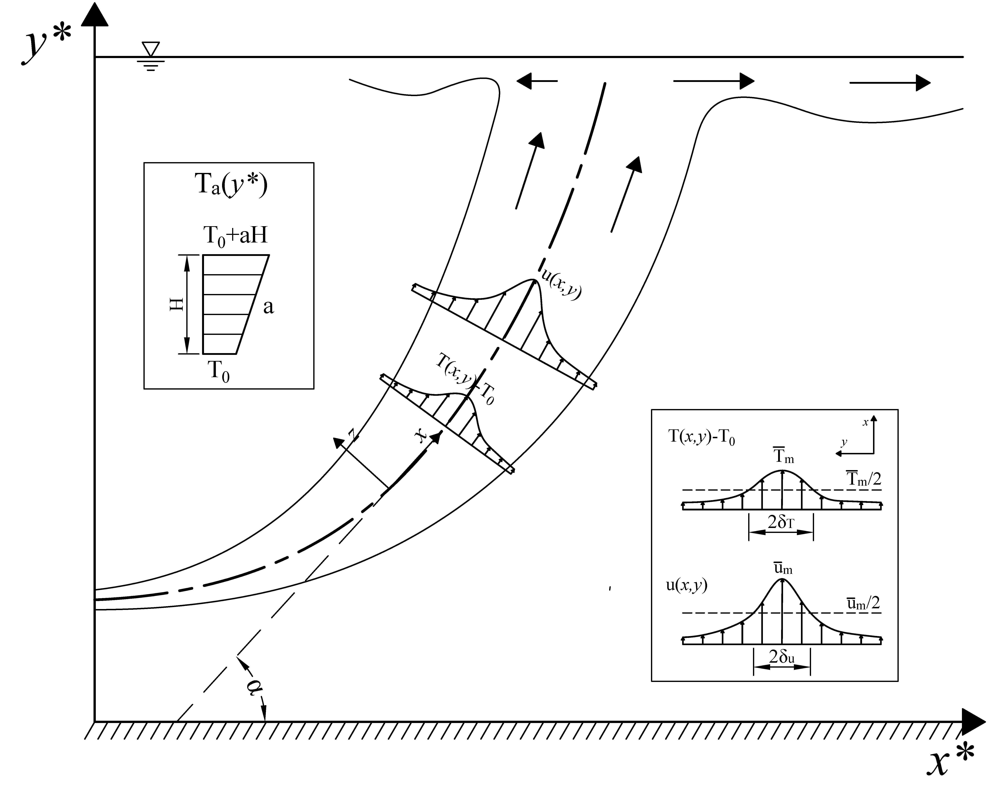
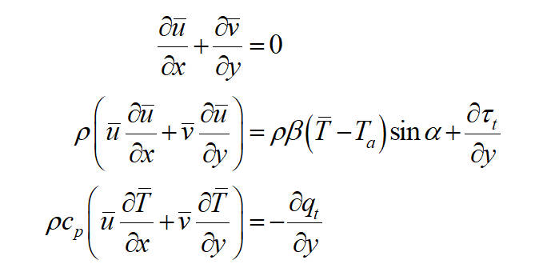
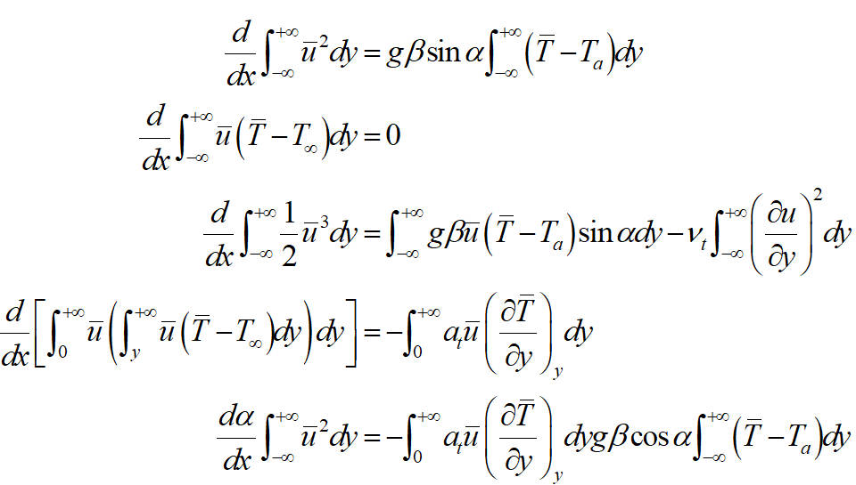
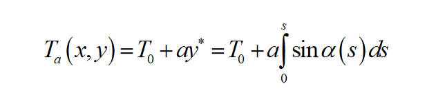

# Jet-boundary-layer-equation
A model for heated buoyancy jet in stratified ambience on MATLAB platform

## Overview
This is a model for buoyant jets running in MATLAB platform. The goal is to model the **jet centerline velocity**, **jet centerline temperature**, **jet velocity half-width**, **jet temperature half-width**, and **jet trajectory**. This model provides a reliable representation of buoyant jet hydrodynamics under highly general flow conditions including:
- pure jets
- buoyant (positive and negative) jets
- pure plumes

And the ambient condition is allowed to be:
- non-stratification
- linear stratification
- two-layer stratification

## Example
Before introducing the theory base, it is better to illustrate some examples


### a. horizontal buoyant jet in a linearly stratified ambience

initial conditions:
- initial angle = 0
- density stratification = 20 kg/m<sup>3
- initial buoyancy flux and initial momentum flux

Try this code:
```
XXX


```
This model automatically calculates the result and plot the jet trajectory, and the variables along the jet trajectory (such as the velocity, temperature, half-width, angle, and density). 


### b. negative buoyant jet in a two-layer stratified ambience
initial conditions:
- initial angle = $\pi$ / 4
- density thermocline = 20 kg/m<sup>3
- initial buoyancy flux and initial momentum flux


Try this code:
```
XXX


```


## Theory of the boundary layer equation
This model is based on the paper published by Gersten in 1980, however, the model has been improved for the stratified ambience, which allows for various stratification types. Here is the brief introduction of the theory.

This is a schematic figure for buoyant heated jet:


### a. Establish the equations
This is the classic boundary-layer equation:


These are partial differential equations (PDE) which refuse to be solved. 

The preferred method for solvement is to transfer them to odinary differential equations (ODE) and utilize the effective solvers for ODE to solve this problem. The detail of the transformation process is listed in the reference paper (gersten-1980), here only the result is shown:



These equations are in non-dimentional form. The last equation is obtained from the central force equilibrium condition. It is time-consuming to explain the physical meaning of every parameter, if one is interested, please refer to gersten-1980 for more details.

### b. Solve the equations
The solver selected here is **ode45** function in MATLAB platform. To extend the scope of application of this model, the temperature function is set as a function to represt the stratification, which is expressed as:


Iteration method is applied here to solve the jet trajectory step by step, where the temperature is assumed to be the same.


